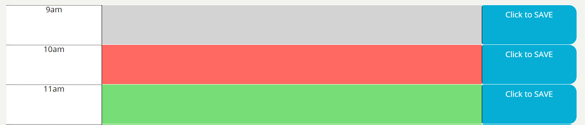

# Corporate Day Planner

 

For an employee to be efficient, an employee must be organized. Without organization, the structor of everyday work life will become more overwhelming. To alleviate the pressures of a hectic work life, the comapany has sent out this application to be used to help the employee become more methodical, systematic, and structured.

 

#

## Table of Contents

~[Purpose](#purpose)
~[Instillation](#instillation)
~[Features](#features)
~[Credits](#credits)

 

## Purpose

#

The purpose of this appliaction is to help catalog any important events, dates or information an employeed would need for the day. It helps structure the work day into hours so that the employee can plan their day accordingly. This will help the employee become more organized and increase productivity.

 
 

## Instillation

#

**To edit/use the application, please follow the steps to pull the repository from GitHub through Git Bash and pull the script into VSCode, provided all three items are already installed on a local network.**

Instillation steps are as follows:

1. Access the repository at [Git Hub] https://github.com/Napica/HW-05-Plan-The-Day.
2. Click on the code section (in green) and clone the SSH key.
3. Once the SSH key is cloned, open the terminal through Git Bash.
4. Find or create the folder the user wants to work in and enter the following commands the the Git terminal:
   1. git clone [copied link] (_this will allow access the repository to the local computer._)
   2. git pull (_this will pull all the lines of script from the local repository._)
   3. code . (\*This will extract the code and link the paths to VSCode for review/editing/uploading)

#### [For Direct Access to GitHub provided application site]

Please click on the link below:

1. https://napica.github.io/HW-05-Plan-The-Day/

 
 

## Features

#

### Updated date with active time
 

 

### Save Button
 

 

### Section with Color-Coded Hours
 

##### *gray = past hours
##### *red = current hour
##### *green = future hours

 
 

## Credit

#

I would like to thank the help of my TA's/Tutors/Classmates for the assisstance in making this application possible.
